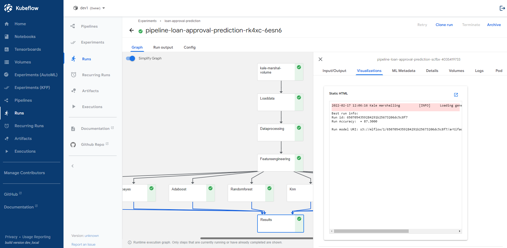
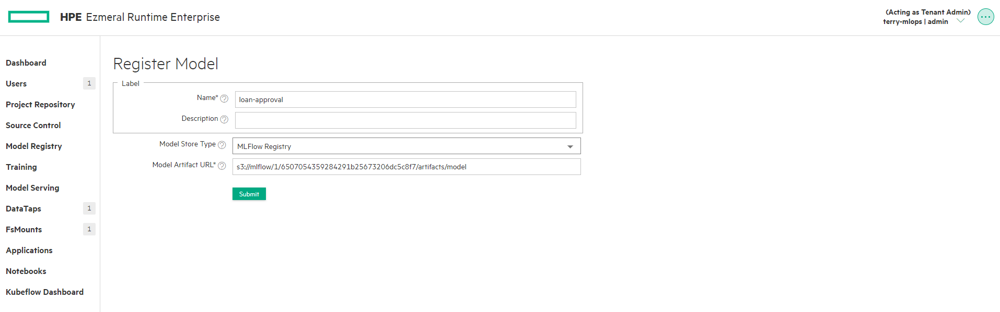
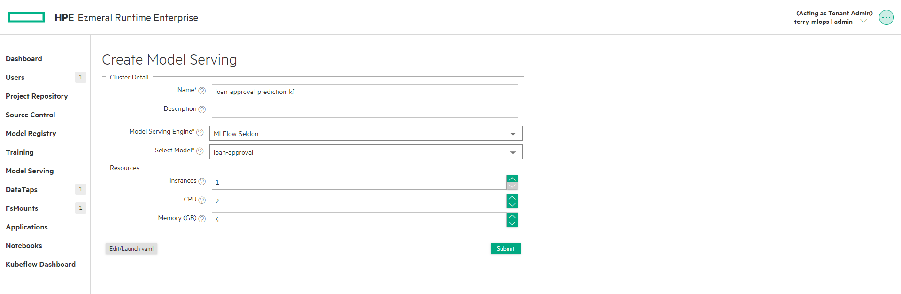
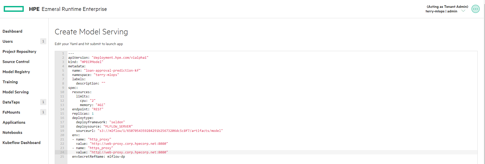

# Steps:
* Execute Prerequisites.ipynb.

## Execute the kubeflow Pipeline
   
   * **When SSL is enabled on Platfrom.** 
    Execute Loan-Approval-Prediction-MinIO-SSL.ipynb.
   
   * **When SSL is not enabled on Platfrom.** 
    Execute Loan-Approval-Prediction-MinIO-NoSSL.ipynb.
   
   Get the best model path from Kubeflow. 
   
   
## Register the Model in Platform Model Registry.
   
   * **Register new mode in Model Registry.** 
   

## Deploy the Model

   * **Deploy the model from Model Serving.** 
   

   Edit the yaml and add secret and proxy var as env. 
   

## Prediction

   * **When SSL is enabled on Platfrom.** 
   Execute the Prediction-SSL.ipynb

   * **When SSL is not enabled on Platfrom.** 
   Execute the Prediction-NoSSL.ipynb
